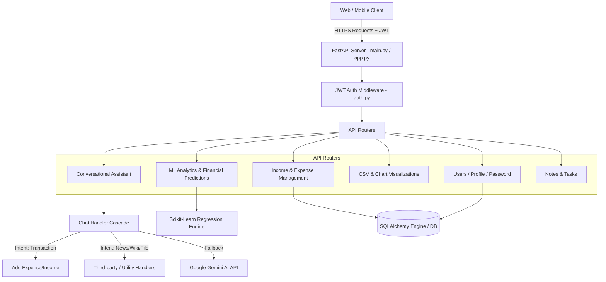

# Vitya AI — Codebase Explanation & Implementation Roadmap

## 1. Executive Summary

**Vitya AI** is an intelligent personal finance and productivity web application backend built using **FastAPI**, **SQLAlchemy**, **Scikit-learn**, and **Google Gemini AI**. The application empowers users to track income and expenses, generate financial predictions and budget advice, manage personal notes and tasks, and interact with a multi-layered conversational AI chatbot.

---

## 2. Technology Stack

| Layer | Technology | Purpose |
| :--- | :--- | :--- |
| **Framework** | [FastAPI](https://fastapi.tiangolo.com/) | High-performance asynchronous REST API framework |
| **Server** | [Uvicorn](https://www.uvicorn.org/) | ASGI Web Server implementation |
| **Database ORM** | [SQLAlchemy 2.0](https://www.sqlalchemy.org/) | Relational database mapping & session handling |
| **Validation** | [Pydantic](https://docs.pydantic.dev/) | Request data parsing & schema validation |
| **Authentication** | [PyJWT](https://pyjwt.readthedocs.io/) / [Jose](https://python-jose.readthedocs.io/) | JWT Token generation and Bearer HTTP verification |
| **Password Security**| [Passlib (bcrypt)](https://passlib.readthedocs.io/) | Password hashing and verification |
| **Machine Learning** | [Scikit-Learn](https://scikit-learn.org/) & [NumPy](https://numpy.org/) | Linear regression prediction, overspending & anomaly detection |
| **AI LLM** | [Google GenAI (Gemini)](https://ai.google.dev/) | Generative text responses and fallback AI capabilities |
| **Export / Media** | [Matplotlib](https://matplotlib.org/) & [Pandas](https://pandas.pydata.org/) | Data visualization, charts, and CSV report export |
| **Database Options** | PostgreSQL / Supabase / SQLite | Dynamic DB URL resolution |

---

## 3. High-Level System Architecture



---

## 4. Codebase Directory Structure & Module Breakdown

```text
backend/
├── app/
│   └── app.py              # Central FastAPI app initialization, middleware, routes mounting
├── api/
│   ├── auth.py             # JWT token creation & authentication dependencies
│   ├── database.py         # SQLAlchemy engine, session maker, DB session dependency
│   ├── models/
│   │   └── vitya.py        # SQLAlchemy ORM models (User, Income, Expense, Note, Task, etc.)
│   ├── routes/
│   │   ├── users.py        # Auth & profile management endpoints
│   │   ├── income.py       # User income CRUD
│   │   ├── expense.py      # User expense CRUD
│   │   ├── ai.py           # Financial prediction, waste analysis, anomaly & budget engine
│   │   └── vitya.py        # Analytics, CSV exports, trend graphs, recent transactions
│   ├── schemas/
│   │   └── vitya.py        # Pydantic schemas for data validation
│   └── WebApp/
│       ├── notes.py        # Notes CRUD endpoints
│       └── tasks.py        # Tasks CRUD endpoints
├── chats/
│   ├── chat.py             # Primary /api/chat router entry point
│   ├── chatbot.py          # Chatbot intent router
│   ├── gemini_service.py   # Google Gemini API integration
│   ├── presentation_api.py # Presentation & PPT generation endpoints
│   ├── handlers/           # Specialized chat intent handlers (transaction, chart, news, wiki, etc.)
│   └── utils/              # Helper utilities (text parsing, themes, weather, wikipedia)
└── main.py                 # Application launcher (Uvicorn runner for Render/Local)
```

---

## 5. Key System Workflows Explained

### 5.1 Authentication & Security (`backend/api/auth.py` & `users.py`)
- **Registration**: Hashes raw passwords using `bcrypt` via `Passlib` and generates a 48-hour access token upon successful registration.
- **Login**: Verifies credentials and returns a signed JWT containing `user_id`.
- **Protected Endpoints**: Utilize FastAPI's `Depends(token_required)` dependency to extract the Bearer token, decode the payload, and inject the authenticated `current_user` object.
- **Password Reset**: Generates a short-lived (15-minute) token with `"purpose": "password_reset"`.

### 5.2 Financial Intelligence & ML Engine (`backend/api/routes/ai.py`)
- **Expense Prediction (`/api/ai/predict/{category}`)**: Trains a `LinearRegression` model on historical category amounts to forecast next month's spending.
- **Overspending Alert (`/api/ai/overspending/{category}`)**: Checks if the latest transaction exceeds 1.5x the historical category average.
- **Smart Budget Planning (`/api/ai/budget-plan`)**: 
  1. Calculates income-tiered savings (10% for <₹20k, 20% for <₹50k, 30% for higher).
  2. Allocates usable funds proportionately across category spending history with a 5% floor guarantee per active category.
- **Waste & Anomaly Detection (`/api/ai/waste-analysis`, `/api/ai/anomaly/{category}`)**: Identifies spending spikes (>2x average) and flags high-velocity expense categories.

### 5.3 Multi-Stage AI Assistant (`backend/chats/`)
When a user sends a message to `/api/chat/`, the request flows through a priority cascade:
1. **Specialized Handlers**: Checked in order: File downloads -> News search -> Wikipedia lookup.
2. **Intent Classifier (`chatbot.py`)**:
   - **Transaction Handler**: Parses natural language expenses/incomes (e.g. *"Spent 250 on groceries"*).
   - **Chart Handler**: Generates visual financial charts based on chat prompt.
   - **Utility Handler**: Performs calculations or unit conversions.
   - **Info Handler**: Responds to platform capability questions.
3. **Gemini Fallback (`gemini_service.py`)**: Direct call to `gemini-flash-latest` model for unhandled natural language queries.

---

## 6. Code Audits & Identified Areas for Improvement

> [!WARNING]
> **Key Maintenance & Security Items Identified**
> 1. **Lack of User Isolation in Notes & Tasks**: `Note` and `Task` models in `vitya.py` currently do not contain a `user_id` foreign key. Endpoints in `backend/api/WebApp/` expose all notes/tasks globally.
> 2. **Duplicate Routes in `backend/api/routes/vitya.py`**: Multiple definitions for `@router.get("/csv")` exist in `vitya.py` (which overwrite each other). Should be unified or renamed.
> 3. **Hardcoded Localhost in Password Recovery**: `users.py` prints `http://localhost:3000/reset-password` instead of dynamically utilizing an environment variable like `FRONTEND_URL`.
> 4. **Synchronous ML Execution**: CPU-bound Scikit-learn operations run directly inside async endpoint functions, which could block the FastAPI event loop during heavy loads.

---

## 7. Actionable Next Steps & Development Roadmap

### Phase 1: Security, Data Privacy & Immediate Refactoring (Target: Sprint 1)
- [ ] **Multi-Tenant Data Isolation**: Add `user_id` foreign key to `Note` and `Task` models and filter query results by `current_user.id`.
- [ ] **Route Clean Up**: Remove duplicate CSV endpoints in `vitya.py` and consolidate into `/export/csv?type=expenses` and `/export/csv?type=incomes`.
- [ ] **Environment Variable Hardening**: Replace hardcoded `localhost:3000` URLs with `FRONTEND_URL` from `.env`.
- [ ] **Input Sanitize & Validation**: Add strict Pydantic rules for transaction amounts (> 0), valid date formats, and file upload extension/size checks.

### Phase 2: System Quality, Testing & Database Operations (Target: Sprint 2)
- [ ] **Automated Test Coverage**: Expand `tests/` directory with comprehensive unit and integration tests using `pytest` and `httpx` (covering Auth, Income/Expense CRUD, and AI calculations).
- [ ] **Alembic Database Migrations**: Integrate Alembic for database migrations instead of relying on `Base.metadata.create_all()` at startup.
- [ ] **Async Worker Tasks**: Offload heavy presentation generation (`presentation_api.py`) and PDF exports to background workers (e.g. Celery / ARQ / FastAPI BackgroundTasks).
- [ ] **Centralized Logging & Error Handler**: Replace basic `print` debugging statements with structured JSON logging and exception middleware.

### Phase 3: Feature Enhancements & Advanced Intelligence (Target: Sprint 3)
- [ ] **Chat Memory & Persistence**: Connect `ChatMessage` and `Conversation` models in `backend/api/models/vitya.py` to the chat pipeline to enable multi-turn conversational context.
- [ ] **Budget Cap Alerts**: Allow users to set fixed monthly category budgets and trigger push/email notifications when approaching limits.
- [ ] **Multi-Currency Support**: Support currency selection per user with conversion rates.
- [ ] **Interactive Dashboard Frontend Integration**: Enhance API response payloads with predefined UI component metadata for seamless frontend rendering.
