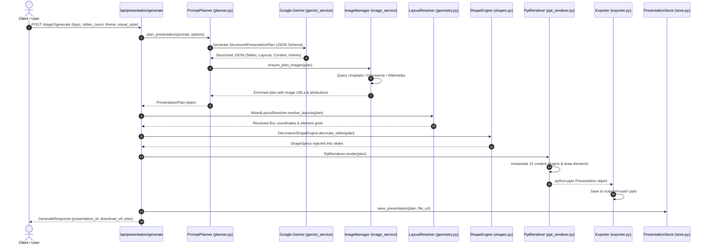
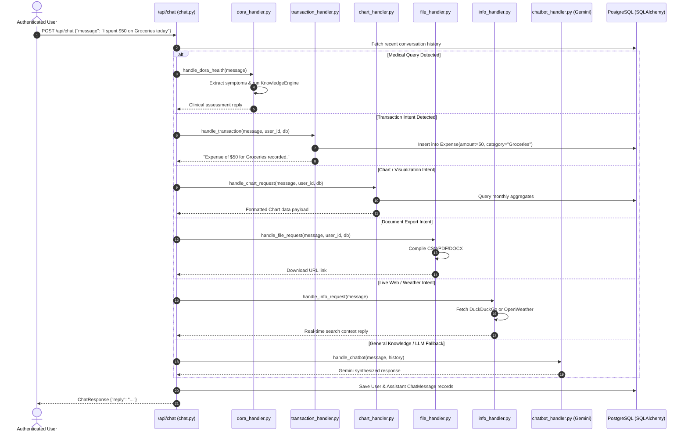

# 05 - End-to-End Data & Event Flows

This document details the complete step-by-step lifecycle of key data operations within the MOTHER backend.

---

## 1. Presentation Generation Pipeline Flow

---

## 2. Conversational Intent & Multi-Agent Dispatch Flow

---

## 3. Financial Analytics & AI Health Score Flow

1. **User requests health score**: `GET /api/ai/health-score`
2. **Data Aggregation**:
   - Fetches all user `Income` records.
   - Fetches all user `Expense` records.
   - Fetches all active `Budget` limits.
   - Fetches active `RecurringSubscription` totals.
3. **Metric Computation** (`compute_financial_health_score`):
   - $	ext{Savings Rate} = rac{	ext{Total Income} - 	ext{Total Expense}}{	ext{Total Income}} 	imes 100$
   - $	ext{Expense Ratio} = rac{	ext{Total Expense}}{	ext{Total Income}} 	imes 100$
   - $	ext{Budget Adherence} = 100 - 	ext{Average Percent Exceeded Across Caps}$
   - $	ext{Subscription Ratio} = rac{	ext{Committed Monthly Subscriptions}}{	ext{Total Monthly Income}} 	imes 100$
4. **Weighted Composite Score**:
   - $Score = 0.35(	ext{Savings}) + 0.25(	ext{Budget Adherence}) + 0.25(100 - 	ext{Expense Ratio}) + 0.15(100 - 	ext{Sub Ratio})$
5. **Output**: Grade assignment (`Excellent`, `Good`, `Fair`, `Needs Attention`) + actionable AI recommendations.